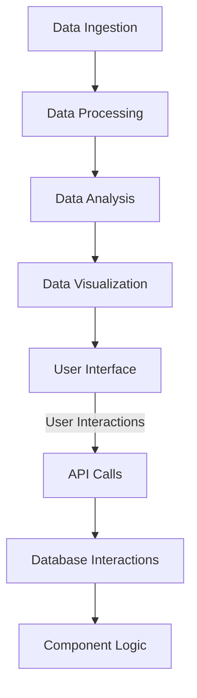

UK Flight Data Analysis 🚀
Unleash the power of data to gain insights into UK flight patterns and trends.


## Overview
UK Flight Data Analysis is a comprehensive tool designed to analyze and visualize flight data within the United Kingdom. This project aims to provide valuable insights into flight patterns, delays, and other critical metrics, assisting stakeholders in making informed decisions and improving operational efficiency.

## Architecture & Workflow

The system is built to efficiently process large datasets, perform complex analyses, and generate visual reports. The architecture is composed of data ingestion, processing, analysis, and visualization components.



## Granular Tech Stack
- **Languages**: Python, SQL
- **Frameworks**: Pandas, NumPy
- **Libraries**: Matplotlib, Seaborn, Scikit-learn
- **Tools**: Jupyter Notebook, Docker

## Key Features
- 📊 Comprehensive data analysis of UK flight data.
- 📈 Visualization of flight patterns and trends.
- 🔍 Insights into flight delays and operational metrics.
- 🚀 Efficient data processing and analysis pipelines.

## Project Structure
```
uk-flight-data-analysis/
│
└── mini project/
    ├── data/
    ├── notebooks/
    ├── src/
    │   ├── analysis.py
    │   ├── visualization.py
    │   └── utils.py
    ├── Dockerfile
    └── requirements.txt
```

## Getting Started

### Prerequisites
- Python 3.8 or higher
- Docker

### Installation
Clone the repository:
```bash
git clone https://github.com/yourusername/uk-flight-data-analysis.git
cd uk-flight-data-analysis
```

Install dependencies:
```bash
pip install -r requirements.txt
```

### Running the Project
Start the application using Docker:
```bash
docker build -t uk-flight-data-analysis .
docker run -p 8888:8888 uk-flight-data-analysis
```

## Usage
Open Jupyter Notebook:
```bash
jupyter notebook
```

Load the dataset and run the analysis scripts in the `notebooks` directory to generate insights and visualizations.

## Roadmap
- Integrate machine learning models for predictive analysis.
- Expand data sources for more comprehensive insights.
- Develop a web-based dashboard for real-time data visualization.

## Contributing
Contributions are welcome! Please fork the repository and submit a pull request for any enhancements or bug fixes.

## License
This project is licensed under the MIT License - see the [LICENSE](LICENSE) file for details.
```
